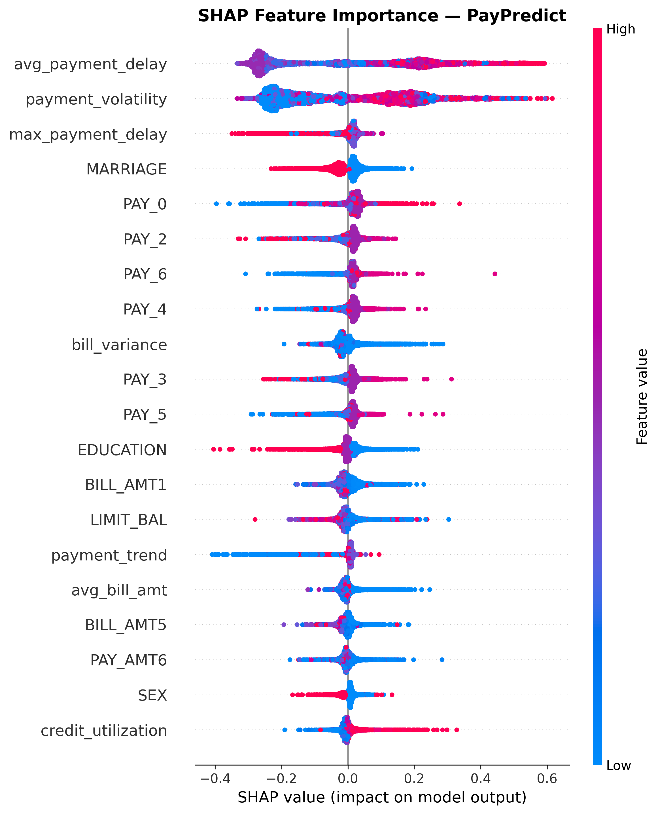

📊 PayPredict — Project Report
🧾 Project Overview
PayPredict is an AI-driven system designed to forecast whether a customer will pay on time or delay their payment.
The project leverages machine learning and explainable AI (XAI) to identify behavioral and financial patterns from transactional data.
This system is valuable for:
Financial institutions to assess credit risk.
E-commerce platforms to reduce delayed payments.
Lending startups to automate risk scoring and improve cash flow prediction.

🎯 Objective
To build a robust, interpretable, and deployable model that:
Predicts customer payment behavior (On-time / Delayed).
Balances class distribution using SMOTE.
Enhances model transparency using SHAP (Explainable AI).
Is deployed through a Flask web app for real-time predictions.

🧠 Technical Summary
Component	Description
Problem Type	Binary Classification
Target Variable	default (0 = on-time, 1 = delayed)
Dataset Size	30,000 records × 30 features
Tools Used	Python, Pandas, XGBoost, Scikit-learn, Flask, SHAP
Model Type	Fusion Ensemble (XGBoost + Random Forest + Logistic Regression)
Deployment	Flask + HTML/CSS frontend
Explainability	SHAP (SHapley Additive exPlanations)

⚙️ Data Preprocessing
Removed Duplicates:
Cleaned dataset → 29,965 rows.
Ensured unique transaction-level data.
Encoded Categorical Columns:
Converted SEX, EDUCATION, and MARRIAGE to numerical category codes.
Feature Engineering:
Created additional predictive features:
avg_bill_amt → Average of last 6 billing cycles
avg_pay_amt → Average of last 6 payment amounts
payment_ratio → Average payment / average bill
bill_variance → Variability in billing patterns
utilization → Credit utilization ratio
Handling Imbalance:
Used SMOTE (Synthetic Minority Oversampling Technique) to balance delayed vs. on-time customers.
🤖 Model Development
📘 1️⃣ Base Models Trained
Model	Accuracy	ROC-AUC
Logistic Regression	0.807	0.735
XGBoost	0.818	0.778
⚡ 2️⃣ Fusion Ensemble
Combined XGBoost, Random Forest, and Logistic Regression using VotingClassifier (soft voting).
Achieved balanced accuracy and interpretability.
📈 Final Results
Metric	Value
✅ Accuracy	0.81
✅ ROC-AUC	0.766
Precision (Delayed)	0.59
Recall (Delayed)	0.41
F1-score (Delayed)	0.49
Weighted Avg F1	0.79
💡 Top Predictive Features (from SHAP)
Rank	Feature	Description
1	PAY_0	Most recent repayment status
2	LIMIT_BAL	Credit limit
3	avg_bill_amt	Average bill amount
4	utilization	Credit utilization rate
5	payment_ratio	Payment vs. bill proportion
6	AGE	Customer age
7	EDUCATION	Educational background

  

🌐 Deployment
The trained model (paypredict_fusion_model.pkl) is deployed via Flask with:
/predict — JSON API endpoint for live predictions
/predict_file — CSV upload endpoint
A clean and responsive HTML frontend under templates/index.html
Launch:
bash run.sh
Access: http://127.0.0.1:7860

🏁 Conclusion
Built an end-to-end ML pipeline for real-world financial risk prediction.
Balanced data using SMOTE and improved fairness of predictions.
Enhanced model interpretability with SHAP.
Fully deployed using Flask for real-time usage.

🚀 Future Enhancements
Integrate Deep Learning models (LSTM for temporal payment history).
Build a React/Next.js frontend.
Deploy on Azure Web App or Render Cloud.
Integrate a real-time feedback loop for model retraining.

👨‍💻 Author
Harsh Rajoria
🎓 B.Tech CSE (AIML) | Data Scientist & AI Developer
📧 rajoriaharsh0@example.com
🌐 LinkedIn : www.linkedin.com/in/harsh-rajoria-a1baa02b4